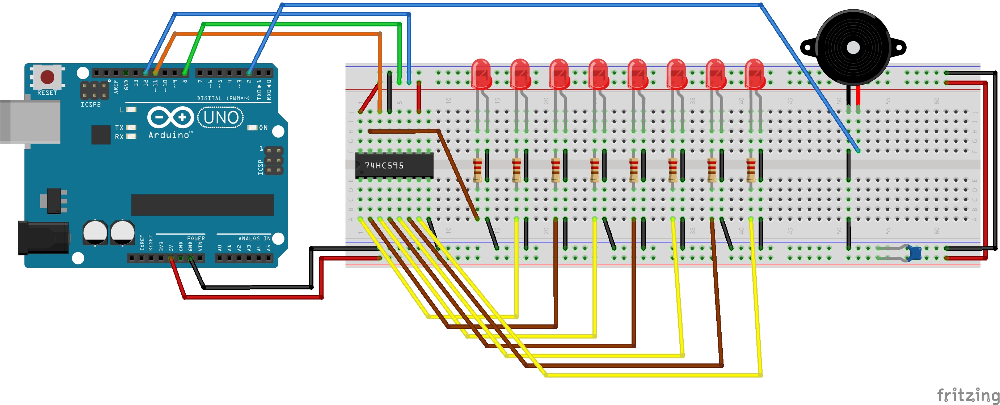

<div align="center">
   <h1>
      Shift Register 8-Bit Binary Counter
   </h1>
   
</div>

## What you need

### For the LED scheme

- 1x Arduino
- 1x 74HC595 Shift Register IC 
- 1x 100 µF Capacitor
- 8x LED
- 8x 220 Ω Resistor
- 1x Buzzer (optional)
- **LOTS OF WIRES**

### For the 7-segment Display scheme

- 1x Arduino
- 1x 74HC595 Shift Register IC 
- 1x 100 µF Capacitor
- 1x 7-segment Display
- 8x 220 Ω Resistor
- 1x Buzzer (optional)
- **LOTS OF WIRES**

## Usage

To compile and upload the code to the Arduino enter the following commands. Replace `<name>` with either `8-bit-counter-led` or `8-bit-counter-display`.

**NOTE**: The commands below assume you are using an Arduino UNO. Refer to the [docs](https://arduino.github.io/arduino-cli/0.27/getting-started/) for more information.

```
$ cd src/                                                           # Navigate inside the source directory
$ arduino-cli compile --fqbn arduino:avr:uno <name>                 # Compile the code
$ arduino-cli upload -p /dev/ttyACM0 --fqbn arduino:avr:uno <name>  # Upload the compiled code to the Arduino UNO
```

**NOTE**: don't forget to update the permissions of `/dev/ttyACM0` (`sudo chmod a+rw /dev/ttyACM0`).

## Electrical scheme

### With LED



### With 7-segment Display

**I'm still building this one.**

## References

- [Bit Shifting](https://www.interviewcake.com/concept/java/bit-shift)
- [74HC595 Datasheet](https://pdf1.alldatasheet.com/datasheet-pdf/view/15644/PHILIPS/74HC595.html)

